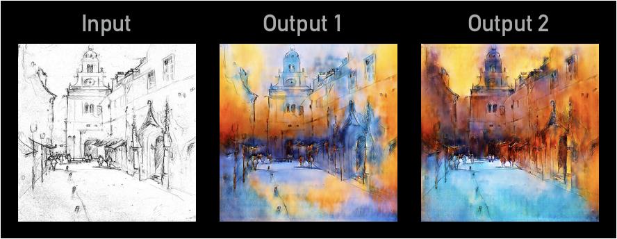

# Watercolor paintings by neural networks

I trained neural networks to generate watercolor paintings from pencil sketches. The input is a pencil sketch drawn by me, and the outputs are watercolor paintings generated by neural networks. See an example below:

# pix2pix 

This image-to-image transfer idea (also known as "pix2pix") is proposed by: 
Phillip Isola, Jun-Yan Zhu, Tinghui Zhou, Alexei A. Efros. 
[Image-to-Image Translation with Conditional Adversarial Networks](https://arxiv.org/abs/1611.07004). 
CVPR 2017.

It designs a conditional variant of [generative adversarial networks](https://arxiv.org/abs/1406.2661) (GAN) to learn a mapping from input images to output images. Some example applications from the original "pix2pix" paper:

# Tensorflow implementation

The implementation is based on the Tensorflow port by [Christopher Hesse](https://github.com/christopherhesse). I made the following changes,
- GAN Discriminator: Multiply discriminator loss by 0.5, as suggested in the original paper. The discriminator tends to learn too fast. Slowing it down indeed improves my results.
- GAN Generator: Add one more layer in encoder and one more layer in decoder, to work with larger images. My training set is very limited, and learning from higher resolution images helps.
- Some clean-up to make the code more “light weight” for my application.

# Observe how GAN learns to paint

GAN initially generates grayish and noisy pixels, and gradually comes up with more colors and details. See an example below:

It is interesting that the learning process of GAN resembles the actual watercolor painting process: start with flat and smooth colors over large areas, and then add more shades and details.

GAN is difficult to train because the loss curves often look weird. For tuning hyper parameters it is helpful (and fun) to watch the generated paintings during training. It seems that if the learning process resembles more the natural painting process, then it results in a better model that can generate better looking paintings in testing phase.

### Prerequisites
- Tensorflow 1.9.0

### Recommended
- Linux with Tensorflow GPU edition + cuDNN
